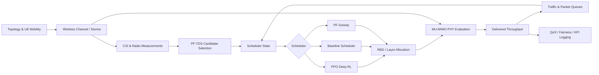

# 5G RAN Scheduler Simulator & Deep RL Testbed

A **Python/PyTorch/Sionna system-level simulation and experimentation framework** for developing, training, and stress-testing cellular radio-resource schedulers.

The project includes a multi-cell wireless simulator, physical-layer-aware scheduling, classical scheduling baselines, a custom PPO training pipeline, traffic and QoS modeling, mobility and handover support, and large-scale robustness experiments.

The work began from an effort to reproduce the scheduling framework described in:

> **From Simulation to Practice: Generalizable Deep Reinforcement Learning for Cellular Schedulers**  
> Petteri Kela, Bryan Liu, and Alvaro Valcarce

but has since grown into a broader research platform for studying **where and why learned radio schedulers fail under realistic network distribution shifts**.

---

## What I Built

This repository is not only an implementation of a neural-network policy.

A major part of the project was building the surrounding wireless system required to train and evaluate that policy.

The framework includes:

- **Multi-cell cellular network simulation**
  - 21-cell / 7-site cellular layouts
  - hundreds of simulated UEs
  - configurable UE density, mobility, traffic, and radio conditions
  - serving-cell association and dynamic handover

- **Physical-layer-aware scheduling**
  - Sionna-based channel generation
  - SINR and achievable-rate computation
  - CQI/rank/spatial channel features
  - SU-MIMO and MU-MIMO scheduling
  - RZF-based multi-user transmission evaluation
  - RBG-level resource allocation

- **Classical radio schedulers**
  - proportional-fair time-domain scheduling
  - iterative baseline scheduler
  - PF-Greedy scheduler
  - throughput-history and fairness tracking

- **Deep reinforcement learning**
  - PPO actor and critic implemented in PyTorch
  - Generalized Advantage Estimation (GAE)
  - clipped PPO optimization
  - multi-cell rollout collection
  - action masking
  - candidate permutation augmentation
  - expert-policy guidance
  - checkpointing and training diagnostics

- **Traffic and QoS simulation**
  - Full Buffer traffic
  - FTP-style packet traffic
  - queues and packet arrivals
  - latency/deadline tracking
  - per-UE service metrics

- **Mobility and handover**
  - temporally evolving wireless channels
  - UE mobility
  - dynamic serving-cell membership
  - persistent UE state across handovers
  - hysteresis and time-to-trigger control
  - packet/QoS state migration across cells

- **Robustness and failure analysis**
  - stale CSI
  - CQI and channel-information corruption
  - changing interference
  - serving-power degradation
  - execution delay
  - missed control deadlines
  - changing traffic load
  - UE availability
  - mobility
  - handover
  - neural-network perturbation and quantization experiments

- **Large-scale experiment infrastructure**
  - reproducible experiment manifests
  - Slurm job arrays
  - GPU execution on an HPC cluster
  - automated validation and recovery
  - CSV-based KPI collection and analysis

---

## Why This Project

Machine-learning schedulers are usually evaluated as if the policy itself were the entire system.

In a real radio scheduler, however, the neural policy sits inside a much larger pipeline:

```text
Radio Channel
     ↓
CSI / Measurements
     ↓
Candidate Selection
     ↓
Scheduler / RL Policy
     ↓
Resource Allocation
     ↓
PHY Execution
     ↓
Traffic / Queue Evolution
     ↓
Next Scheduling Decision
```

A scheduler can therefore fail even when the neural network itself is behaving correctly.

The main research question behind this project became:

> **When a learned scheduler degrades under a network shift, where in the radio-control pipeline does the failure actually originate?**

The simulator was extended specifically to make these failure modes independently controllable and measurable.

---

## System Architecture



The design separates the simulator, PHY, classical schedulers, RL policy, traffic model, and experimental stressors so that individual components can be tested independently.

---

# Deep Reinforcement Learning

The primary learned scheduler uses **Proximal Policy Optimization (PPO)**.

The implementation includes the complete training path rather than relying on a high-level RL library:

```text
Network state
    ↓
Actor
    ↓
Masked multi-discrete scheduling action
    ↓
Physical-layer execution
    ↓
Reward
    ↓
Rollout buffer
    ↓
GAE
    ↓
PPO clipped objective
    ↓
Actor + Critic updates
```

### Actor

The 1LDS scheduling policy receives radio, traffic, history, and spatial information for the candidate UEs.

With 10 scheduler candidates and 18 RBGs, the policy produces:

```text
18 × (10 candidates + no-allocation)
= 198 logits
```

This is represented as **18 categorical scheduling decisions**, one for each RBG.

### Training features

The PPO implementation supports:

- actor/critic networks
- Generalized Advantage Estimation
- PPO clipping
- centralized multi-cell experience collection
- independent scheduling streams
- legal-action masking
- UE/candidate permutation augmentation
- expert demonstration buffers
- proportional-fair expert guidance
- checkpoint save/restore
- training and optimization diagnostics

The trained policy is evaluated using the same physical scheduler pipeline as the classical schedulers.

---

## Physical-Layer Simulation

Instead of assigning synthetic rewards directly to scheduling actions, resource allocations are evaluated through the wireless simulation stack.

The PHY pipeline includes components for:

```text
Channel
   ↓
RBG representation
   ↓
Candidate UE channels
   ↓
Precoding / RZF
   ↓
Post-processing SINR
   ↓
Link adaptation
   ↓
Estimated achievable rate
```

This allows experiments to distinguish between failures caused by the scheduler and failures caused by changes that happen **after the scheduling decision has already been made**.

---

## Classical Scheduling Baselines

The framework also implements non-learning schedulers for controlled comparisons.

### PF-TDS

Proportional-fair time-domain scheduling produces the candidate set available to the frequency-domain scheduler.

### Iterative Baseline Scheduler

Candidates are examined iteratively and allocations are accepted when they improve the estimated RBG throughput.

### PF-Greedy

A more computationally intensive scheduler evaluates candidate alternatives and selects decisions according to a proportional-fair scheduling metric.

These baselines are important because a degradation that affects **PPO, Baseline, and PF-Greedy simultaneously** is very different from a failure specific to the learned policy.

---

# Robustness & Failure Localization

The simulator has been extended into a controlled robustness testbed.

Rather than applying arbitrary noise to the neural network, experiments target different parts of the scheduling pipeline.

| Failure location | Example experiments |
|---|---|
| Policy | adversarial feature perturbation, parameter noise |
| Representation | neuron ablation, quantization, normalization shift |
| Candidate selection | delayed CSI / stale PF-TDS state |
| Traffic | load and burstiness changes |
| PHY execution | unexpected interference, serving-power changes |
| Control loop | delayed actions, missed computation deadlines |
| Mobility | temporally evolving channels |
| Association | dynamic serving-cell handover |

This makes it possible to ask not only **whether performance decreased**, but **why**.

---

## Example: Localizing CSI-Staleness Failure

One controlled experiment separated two possible causes of stale-CSI degradation:

1. stale candidate selection with fresh PPO observations
2. fresh candidate selection with stale PPO observations

In that experiment, restoring the candidate-selection path recovered almost all of the lost performance, while restoring only the PPO-side observations recovered very little.

The result indicates that the dominant failure in that setting occurred **upstream of the neural policy**.

The PPO cannot select a good UE if that UE has already been removed from its candidate set.

This motivated a broader theme of the project:

> **Improving the ML model alone cannot solve failures introduced elsewhere in the control pipeline.**

---

## Example: Execution-Time PHY Shift

The opposite behavior appears when radio conditions change *after* a scheduling decision.

Under strong post-decision interference, candidate selection remains essentially unchanged while delivered throughput drops sharply.

This isolates a different failure location:

```text
Correct candidates
      +
Valid scheduler decision
      ↓
Unexpected PHY conditions
      ↓
Poor realized throughput
```

The issue is therefore an execution-model mismatch rather than a candidate-selection failure.

---

## Dynamic Mobility and Handover

The simulator also supports persistent UE identity across serving-cell changes.

A handover must migrate more than a serving-cell index. The implementation maintains state such as:

- UE identity
- queue and packet state
- throughput history
- scheduling history
- serving-cell membership
- QoS state

The resulting control loop is approximately:

```text
Sionna radio measurement
        ↓
Hysteresis / Time-to-Trigger
        ↓
Association decision
        ↓
UE state migration
        ↓
Dynamic scheduler membership
        ↓
Scheduling on destination cell
```

This allows association failures and scheduler failures to be studied separately.

---

# Repository Structure

```text
oran-deep-scheduler/
│
├── src/oran_scheduler/
│   ├── simulator/        # topology, channels, traffic, association
│   ├── phy/              # SINR, rate, MIMO and link adaptation
│   ├── schedulers/       # PF-TDS, baseline and PF-Greedy schedulers
│   ├── state/            # 1LDS scheduler observations/features
│   ├── rl/               # PPO training and evaluation stack
│   └── utils/            # profiling and shared utilities
│
├── tests/                # unit and integration tests
│
├── scripts/              # training, validation and experiment runners
│
├── experiments/          # experiment manifests and analysis artifacts
│
├── docs/                 # reproduction and simulator documentation
│
└── pyproject.toml
```

---

# Tech Stack

**Machine Learning**

- Python
- PyTorch
- PPO / actor-critic reinforcement learning
- NumPy

**Wireless Simulation**

- NVIDIA Sionna
- multi-cell channel simulation
- MU-MIMO
- RZF precoding
- CQI / CSI-based scheduling
- proportional-fair scheduling

**Engineering / Experimentation**

- pytest
- Git / GitHub
- Slurm
- Linux
- GPU computing
- University of Utah CHPC

---

# Running the Project

Create an environment with Python 3.11 and install the project:

```bash
git clone git@github.com:mhrafi66/oran-deep-scheduler.git
cd oran-deep-scheduler

python -m pip install -e .
```

Run the test suite:

```bash
pytest
```

Individual sanity/integration scripts are available under:

```text
scripts/
```

For example, the repository contains tools for validating topology generation, channel construction, physical-layer rates, PF scheduling, PPO integration, and robustness experiments.

Large system-level experiments are designed to run on GPU compute nodes and can require substantial memory and execution time.

---

# Validation

The project uses unit and integration tests throughout the simulation and learning stack.

Tests cover areas including:

- topology and cell association
- channel/RBG processing
- SINR and rate calculations
- MIMO scheduling
- classical scheduler behavior
- scheduler state construction
- PPO actor/critic behavior
- GAE and PPO updates
- action masking
- rollout buffers
- expert guidance
- multi-cell training
- traffic evolution
- temporal simulation
- mobility and handover
- robustness perturbations

The emphasis is on validating components independently before combining them into full system-level experiments.

---

# Research Scope

This repository is an **independent open implementation**.

The original Nokia/Bell Labs work uses a proprietary system-level cellular simulator and contains implementation details that are not publicly available.

Where the paper precisely specifies an algorithm or parameter, this project attempts to reproduce it faithfully. Where details are unavailable, the repository uses explicit open-reproduction assumptions implemented with Sionna and custom simulation components.

The robustness, mobility, failure-localization, and handover experiments extend beyond straightforward reproduction of the original paper.

---

# Reference

The initial scheduler architecture and experimental motivation were based on:

> Petteri Kela, Bryan Liu, and Alvaro Valcarce,  
> **“From Simulation to Practice: Generalizable Deep Reinforcement Learning for Cellular Schedulers.”**  
> arXiv:2411.08529.

---

# Author

**Md Mumtahin Habib Ullah Mazumder**  
PhD Student in Computer Science  
University of Utah

Research interests include machine learning for wireless systems, reinforcement learning, networking, and robust intelligent systems.
